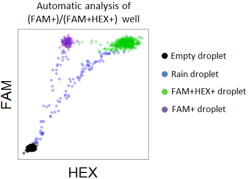
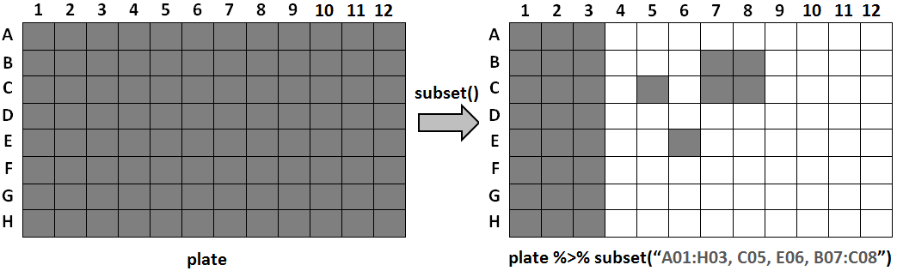

<!-- README.md is generated from README.Rmd. Please edit that file -->
ddpcr: Analysis and visualization of Digital Droplet PCR data in R and on the web
=================================================================================

This package provides an interface to explore, analyze, and visualize droplet digital PCR (ddPCR) data in R. An interactive tool was also created and is available online to facilitate this analysis for anyone who is not comfortable with using R.

Background
----------

Droplet Digital PCR (ddPCR) is a technology provided by Bio-Rad for performing digital PCR. The basic workflow of ddPCR involves three main steps: partitioning sample DNA into 20,000 droplets, PCR amplifying the nucleic acid in each droplet, and finally passing the droplets through a reader that detects flurescent intensities in two different wavelengths corresponding to FAM and HEX dyes. As a result, the data obtained from a ddPCR experiment can be visualized as a 2D scatterplot (one dimension is FAM intensity and the other dimension is HEX intensity) with 20,000 points (each droplet represents a point).

ddPCR experiments can be defined as singleplex, duplex, or multiplex depending on the number of dyes used (one, two, and more than two, respectively). A duplex experiment typically uses one FAM dye and one HEX dye, and consequently the droplets will be grouped into one of four clusters: double-negative (not emitting fluorescence from either dye), HEX-positive, FAM-positive, or double-positive. When plotting the droplets, each quadrant of the plot corresponds to a cluster; for example, the droplets in the lower-left quadrant are the double-negative droplets.

After running a ddPCR experiment, a key step in the analysis is gating the droplets to determine how many droplets belong to each cluster. Bio-Rad provides an analysis software called QuantaSoft which can be used to perform gating. QuantaSoft can either do the gating automatically or allow the user to set the gates manually. Most ddPCR users currently gate their data manually because QuantaSoft's automatic gating often does a poor job and **there are no other tools available for gating ddPCR data**.

Overview
--------

The `ddpcr` package allows you to upload ddPCR data, perform some basic analysis, explore characteristic of the data, and create customizable figures of the data.

### Main features

The main features include:

-   **Identify failed wells** - determining which wells in the plate seemed to have failed the ddPCR experiment, and thus these wells will be excluded from all downstream analysis. No template control (NTC) will be deemed as failures by this tool.
-   **Identify outlier droplets** - sometimes a few droplets can have an extremely high fluorescent intensity value that is probably erroneous, perhaps as a result of an error with the fluorescent reader. These droplets are identified and removed from the downstream analysis.
-   **Identify empty droplets** - droplets with very low fluorescent emissions are considered empty and are removed from the downstream analysis. Removing these droplets is beneficial for two reasons: 1. the size of the data is greatly reduced, which means the computations will be faster on the remaining droplets, and 2. the real signal of interest is in the non-empty droplets, and empty droplets can be regarded as noise.
-   **Calculating template concentration** - after knowing how many empty droplets are in each well, the template concentration in each well can be calculated.
-   **Gating droplets** - if your experiment matches some criteria (more on that soon), then automatic gating can take place; otherwise, you can gate the data manually just like on QuantaSoft.
-   **Explore results** - the results from each well (\# of drops, \# of outliers, \# of empty drops, concentration) can be explored as a histogram or boxplot to see the distribution of all wells in the plate.
-   **Plot** - you can plot the data in the plate with many customizable features.

### Supported experiment types

While this tool was originally developed to automatically gate data for a particular ddPCR assay (the paper for that experiment is in progress), any assay with similar characteristics can also use this tool to automatically gate the droplets. In order to benefit from the full automatic analysis, your ddPCR experiment needs to have these characteristics:

-   The experiment is a duplex ddPCR experiment
-   The majority of droplets are empty (double-negative)
-   The majority of non-empty droplets are double-positive
-   There can be a third cluster of either FAM+ or HEX+ droplets

In other words, the built-in automatic gating will work when there are three clusters of droplets: (1) double-negative, (2) double-positive, and (3) either FAM+ or HEX+. These types of experiments will be referred to as **(FAM+)/(FAM+HEX+)** or **(HEX+)/(FAM+HEX+)**. Both of these experiment types fall under the name of **PNPP experiments**; PNPP is short for PositiveNegative/PositivePositive, which is a reflection of the droplet clusters. Here is what a typical well from a PNPP experiment looks like:

[](vignettes/figures/supported-exp-types.png)

If your experiment matches the criteria for a **PNPP** experiment (either a **(FAM+)/(FAM+HEX+)** or a **(HEX+)/(FAM+HEX+)** experiment), then after calculating empty droplets the program will analyze the rest of the droplets and assign each droplet one of the following three clustes: FAM+ (or HEX+), FAM+HEX+, or rain. Here is the result of analyzing a single well from a **(FAM+)/(FAM+HEX+)** experiment:

[](vignettes/figures/ppnp-simple-result.png)

If your ddPCR experiment is not a **PNPPP** type, you can still use this tool for the rest of the analysis, exploration, and plotting, but it will not benefit from the automatic gating. However, `ddpcr` is built to be easily extensible, which means that you can add your own experiment "type". Custom experiment types need to define their own method for gating the droplets in a well, and then they can be used in the same way as the built-in experiment types.

Analysis using the interactive tool
-----------------------------------

If you're not comfortable using R and would like to use a visual tool that requires no programming, you can [use the tool online](TODO). If you do know how to run R, using the interactive tool (built with [shiny](http://shiny.rstudio.com/))

Analysis using R
----------------

Enough talking, time for action!

First, install `ddpcr`

    devtools::install_github("daattali/ddpcr")

### Quick start

Here are two basic examples of how to use `ddpcr` to analyze and plot your ddPCR data. One example shows an analysis where the gating thresholds are manually set, and the other example uses the automated analysis. Note how `ddpcr` is designed to play nicely with the [magrittr pipe](https://github.com/smbache/magrittr) `%>%` for easier pipeline workflows. Explanation will follow, these are just here as a spoiler.

``` r
library(ddpcr)
dir <- system.file("sample_data", "small", package = "ddpcr")

# example 1: manually set thresholds
new_plate(dir, type = CROSSHAIR_THRESHOLDS) %>%
  subset("B01,B06") %>%
  set_thresholds(c(5000, 7500)) %>%
  analyze %>%
  plot(show_grid_labels = TRUE, title = "Ex 1 - manually set gating thresholds")

# example 2: automatic gating
new_plate(dir, type = FAM_POSITIVE_PPNP) %>%
  subset("B01:B06") %>%
  analyze %>%
  plot(show_mutant_freq = FALSE, show_grid_labels = TRUE, title = "Ex 2 - automatic gating")
```


### Loading ddPCR data

The first step is to get the ddPCR data into R. `ddpcr` uses the data files that are exported by QuantaSoft as its input. You need to have all the well files for the wells you want to analyze (one file per well), and you can optionally add the results file from QuantaSoft. If you loaded an experiment named *2015-05-20\_mouse* with 50 wells to QuantaSoft, then QuantaSoft will export the following files:

-   50 data files (well files): each well will have its own file with the name ending in \*\_Amplitude.csv". For example, the droplets in well A01 will be saved in *2015-05-20\_mouse\_A01\_Aamplitude.csv*
-   1 results file: a small file named *2015-05-20\_mouse.csv* will be generated with some information about the plate, including the name of the sample in each well (assuming you named the samples previously)

The well files are the only required input to `ddpcr`, and since ddPCR plates contain 96 wells, you can upload anywhere from 1 to 96 well files. The results file is not mandatory, but if you don't provide it then the wells will not have sample names attached to them.

`ddpcr` contains a sample dataset called *small* that has 5 wells. We use the `new_plate()` function to initialize a new ddPCR plate object. If given a directory, it will automatically find all the valid well files in the directory and attempt to find a matching results file.

``` r
library(ddpcr)
dir <- system.file("sample_data", "small", package = "ddpcr")
plate <- new_plate(dir)
#> Reading data files into plate... DONE (0 seconds)
#> Initializing plate of type `ddpcr_plate`... DONE (0 seconds)
```

You will see some messages appear - every time `ddpcr` runs an analysis step (initializing the plate is part of the analysis), it will output a message decribing what it's doing.

### Explore the data pre-analysis

We can explore the data we loaded even before doing any analysis

``` r
plate
#> ddpcr plate
#> -----------
#> Dataset name: small
#> Plate type: ddpcr_plate
#> Data summary: 5 wells; 76,143 drops
#> Completed analysis steps: INITIALIZE
#> Remaining analysis steps: REMOVE_FAILURES, REMOVE_OUTLIERS, REMOVE_EMPTY
```

Among other things, this tells us how many wells and total droplets we have in the data, and what steps of the analysis are remaining. All the information that gets shown when you print a ddpcr plate object is also available through other functions that are dedicated to show one piece of information. For example

``` r
plate %>% name
#> [1] "small"
plate %>% type
#> [1] "ddpcr_plate"
```

Since we didn't specify an experiment type, this plate object has the default type of `ddpcr_plate`.

We can see what wells are in our data with `wells_used()`

``` r
plate %>% wells_used
#> [1] "B01" "B06" "C01" "C06" "C09"
```

There are 5 wells because the sample data folder has 5 well files.

We can see all the droplets data with `plate_data()`

``` r
plate %>% plate_data
#> Source: local data frame [76,143 x 4]
#> 
#>    well  HEX  FAM cluster
#> 1   B01 1374 1013       1
#> 2   B01 1411 1018       1
#> 3   B01 1428 1024       1
#> 4   B01 1313 1026       1
#> 5   B01 1362 1027       1
#> 6   B01 1290 1028       1
#> 7   B01 1319 1030       1
#> 8   B01 1492 1032       1
#> 9   B01 1312 1036       1
#> 10  B01 1294 1037       1
#> ..  ...  ...  ...     ...
```

This shows us the fluorescent intensities of each droplet, along with the current cluster assignment of each droplet. Right now all droplets are assigned to cluster 1 which corresponds to *undefined* since no analysis has taken place yet. You can see all the clusters that a droplet can belong to with the `clusters()` function

``` r
plate %>% clusters
#> [1] "UNDEFINED" "FAILED"    "OUTLIER"   "EMPTY"
```

This tells us that any droplet in a `ddpcr_plate`-type experiment can be classified into those clusters.

We can see the results of the plate so far with `plate_meta()`

``` r
plate %>% plate_meta(only_used = TRUE)
#>   well sample row col used drops
#> 1  B01     #1   B   1 TRUE 17458
#> 2  B06     #9   B   6 TRUE 13655
#> 3  C01     #3   C   1 TRUE 15279
#> 4  C06    #12   C   6 TRUE 14513
#> 5  C09    #30   C   9 TRUE 15238
```

The `only_used` parameter is used so that we'll only get data about the 5 existing wells and ignore the other 91 unused wells on the plate. Notice that *meta* (short for *metadata*) is used instead of *results*. This is because the meta/results table contains information for each well such as its name, number of drops, number of empty drops, concentration, and many other calculated values.

### Subset the plate

If you aren't interested in all the wells, you can use the `subset()` function to retain only certain wells. Alternatively, you can use the `data_files` argument of the `new_plate()` function to only load certain well files instead of a full directory.
The `subset()` function can take accept either a list of sample names, a list of wells, or a special *range notation*. The range notation is a convenient way to select many wells: use a colon (`:`) to specify a range of wells and a comma (`,`) to add another well or range. A range of wells is defined as all wells in the rectangular area between the two endpoints. For example, `B05:C06` corresponds to the four wells `B05, B06, C05, C06`. The following diagram shows the result of subsetting with a range notation of `A01:H03, C05, E06, B07:C08` on a plate that initially contains all 96 wells.

[](vignettes/figures/ex-subset.png)

Back to our data: we have 5 wells, let's keep 4 of them

``` r
plate <- plate %>% subset("B01:C06")
# could have also used subset("B01, B06, C01, C06")
plate %>% wells_used
#> [1] "B01" "B06" "C01" "C06"
```

### Run analysis

An analysis of a ddPCR plate consists of running the plate through a sequence of steps. You can see what all the steps for a particular experiment are

``` r
plate %>% steps %>% names
#> [1] "INITIALIZE"      "REMOVE_FAILURES" "REMOVE_OUTLIERS" "REMOVE_EMPTY"
```

These steps are the default steps that any ddpcr plate will go through by default if no type is specified. At this point all we did was load the data, so the initialization step was done and there are 3 remaining steps. You can either run through the steps one by one using `next_steps()` or run all remaining steps with `analyze()`.

``` r
plate <- plate %>% analyze
#> Identifying failed wells... DONE (0 seconds)
#> Identifying outlier droplets... DONE (0 seconds)
#> Identifying empty droplets... DONE (1 seconds)
#> Analysis complete
# equivalent to `plate %>% next_step(3)`
# also equivalent to `plate %>% next_step %>% next_step %>% next_step`
```

As each step of the analysis is performed, a message describing the current step is printed to the screen. Since we only have 2 wells, it should be very fast, but when you have a full 96-well plate, the analysis could take several minutes. Sometimes it can be useful to run each step individually rather than all of them together if you want to inspect the data after each step.

### Explore the data post-analysis

We can look at the plate again, now that it has been analyzed.

``` r
plate
#> ddpcr plate
#> -----------
#> Dataset name: small
#> Plate type: ddpcr_plate
#> Data summary: 4 wells; 60,905 drops
#> Analysis completed
plate %>% plate_data
#> Source: local data frame [60,905 x 4]
#> 
#>    well  HEX  FAM cluster
#> 1   B01 1374 1013       4
#> 2   B01 1411 1018       4
#> 3   B01 1428 1024       4
#> 4   B01 1313 1026       4
#> 5   B01 1362 1027       4
#> 6   B01 1290 1028       4
#> 7   B01 1319 1030       4
#> 8   B01 1492 1032       4
#> 9   B01 1312 1036       4
#> 10  B01 1294 1037       4
#> ..  ...  ...  ...     ...
plate %>% plate_meta
#>    well sample row col  used drops success
#> 1   B01     #1   B   1  TRUE 17458    TRUE
#> 2   B06     #9   B   6  TRUE 13655    TRUE
#> 3   C01     #3   C   1  TRUE 15279    TRUE
#> 4   C06    #12   C   6  TRUE 14513   FALSE
#> 5   A01   <NA>   A   1 FALSE    NA      NA
#> 6   A02   <NA>   A   2 FALSE    NA      NA
#> 7   A03   <NA>   A   3 FALSE    NA      NA
#> 8   A04   <NA>   A   4 FALSE    NA      NA
#> 9   A05   <NA>   A   5 FALSE    NA      NA
#> 10  A06   <NA>   A   6 FALSE    NA      NA
#> 11  A07   <NA>   A   7 FALSE    NA      NA
#> 12  A08   <NA>   A   8 FALSE    NA      NA
#> 13  A09   <NA>   A   9 FALSE    NA      NA
#> 14  A10   <NA>   A  10 FALSE    NA      NA
#> 15  A11   <NA>   A  11 FALSE    NA      NA
#> 16  A12   <NA>   A  12 FALSE    NA      NA
#> 17  B02   <NA>   B   2 FALSE    NA      NA
#> 18  B03   <NA>   B   3 FALSE    NA      NA
#> 19  B04   <NA>   B   4 FALSE    NA      NA
#> 20  B05   <NA>   B   5 FALSE    NA      NA
#> 21  B07   <NA>   B   7 FALSE    NA      NA
#> 22  B08   <NA>   B   8 FALSE    NA      NA
#> 23  B09   <NA>   B   9 FALSE    NA      NA
#> 24  B10   <NA>   B  10 FALSE    NA      NA
#> 25  B11   <NA>   B  11 FALSE    NA      NA
#> 26  B12   <NA>   B  12 FALSE    NA      NA
#> 27  C02   <NA>   C   2 FALSE    NA      NA
#> 28  C03   <NA>   C   3 FALSE    NA      NA
#> 29  C04   <NA>   C   4 FALSE    NA      NA
#> 30  C05   <NA>   C   5 FALSE    NA      NA
#> 31  C07   <NA>   C   7 FALSE    NA      NA
#> 32  C08   <NA>   C   8 FALSE    NA      NA
#> 33  C09   <NA>   C   9 FALSE    NA      NA
#> 34  C10   <NA>   C  10 FALSE    NA      NA
#> 35  C11   <NA>   C  11 FALSE    NA      NA
#> 36  C12   <NA>   C  12 FALSE    NA      NA
#> 37  D01   <NA>   D   1 FALSE    NA      NA
#> 38  D02   <NA>   D   2 FALSE    NA      NA
#> 39  D03   <NA>   D   3 FALSE    NA      NA
#> 40  D04   <NA>   D   4 FALSE    NA      NA
#> 41  D05   <NA>   D   5 FALSE    NA      NA
#> 42  D06   <NA>   D   6 FALSE    NA      NA
#> 43  D07   <NA>   D   7 FALSE    NA      NA
#> 44  D08   <NA>   D   8 FALSE    NA      NA
#> 45  D09   <NA>   D   9 FALSE    NA      NA
#> 46  D10   <NA>   D  10 FALSE    NA      NA
#> 47  D11   <NA>   D  11 FALSE    NA      NA
#> 48  D12   <NA>   D  12 FALSE    NA      NA
#> 49  E01   <NA>   E   1 FALSE    NA      NA
#> 50  E02   <NA>   E   2 FALSE    NA      NA
#> 51  E03   <NA>   E   3 FALSE    NA      NA
#> 52  E04   <NA>   E   4 FALSE    NA      NA
#> 53  E05   <NA>   E   5 FALSE    NA      NA
#> 54  E06   <NA>   E   6 FALSE    NA      NA
#> 55  E07   <NA>   E   7 FALSE    NA      NA
#> 56  E08   <NA>   E   8 FALSE    NA      NA
#> 57  E09   <NA>   E   9 FALSE    NA      NA
#> 58  E10   <NA>   E  10 FALSE    NA      NA
#> 59  E11   <NA>   E  11 FALSE    NA      NA
#> 60  E12   <NA>   E  12 FALSE    NA      NA
#> 61  F01   <NA>   F   1 FALSE    NA      NA
#> 62  F02   <NA>   F   2 FALSE    NA      NA
#> 63  F03   <NA>   F   3 FALSE    NA      NA
#> 64  F04   <NA>   F   4 FALSE    NA      NA
#> 65  F05   <NA>   F   5 FALSE    NA      NA
#> 66  F06   <NA>   F   6 FALSE    NA      NA
#> 67  F07   <NA>   F   7 FALSE    NA      NA
#> 68  F08   <NA>   F   8 FALSE    NA      NA
#> 69  F09   <NA>   F   9 FALSE    NA      NA
#> 70  F10   <NA>   F  10 FALSE    NA      NA
#> 71  F11   <NA>   F  11 FALSE    NA      NA
#> 72  F12   <NA>   F  12 FALSE    NA      NA
#> 73  G01   <NA>   G   1 FALSE    NA      NA
#> 74  G02   <NA>   G   2 FALSE    NA      NA
#> 75  G03   <NA>   G   3 FALSE    NA      NA
#> 76  G04   <NA>   G   4 FALSE    NA      NA
#> 77  G05   <NA>   G   5 FALSE    NA      NA
#> 78  G06   <NA>   G   6 FALSE    NA      NA
#> 79  G07   <NA>   G   7 FALSE    NA      NA
#> 80  G08   <NA>   G   8 FALSE    NA      NA
#> 81  G09   <NA>   G   9 FALSE    NA      NA
#> 82  G10   <NA>   G  10 FALSE    NA      NA
#> 83  G11   <NA>   G  11 FALSE    NA      NA
#> 84  G12   <NA>   G  12 FALSE    NA      NA
#> 85  H01   <NA>   H   1 FALSE    NA      NA
#> 86  H02   <NA>   H   2 FALSE    NA      NA
#> 87  H03   <NA>   H   3 FALSE    NA      NA
#> 88  H04   <NA>   H   4 FALSE    NA      NA
#> 89  H05   <NA>   H   5 FALSE    NA      NA
#> 90  H06   <NA>   H   6 FALSE    NA      NA
#> 91  H07   <NA>   H   7 FALSE    NA      NA
#> 92  H08   <NA>   H   8 FALSE    NA      NA
#> 93  H09   <NA>   H   9 FALSE    NA      NA
#> 94  H10   <NA>   H  10 FALSE    NA      NA
#> 95  H11   <NA>   H  11 FALSE    NA      NA
#> 96  H12   <NA>   H  12 FALSE    NA      NA
#>                                                             comment
#> 1                                                              <NA>
#> 2                                                              <NA>
#> 3                                                              <NA>
#> 4  There are too many empty drops (lambda of lower cluster: 0.9983)
#> 5                                                              <NA>
#> 6                                                              <NA>
#> 7                                                              <NA>
#> 8                                                              <NA>
#> 9                                                              <NA>
#> 10                                                             <NA>
#> 11                                                             <NA>
#> 12                                                             <NA>
#> 13                                                             <NA>
#> 14                                                             <NA>
#> 15                                                             <NA>
#> 16                                                             <NA>
#> 17                                                             <NA>
#> 18                                                             <NA>
#> 19                                                             <NA>
#> 20                                                             <NA>
#> 21                                                             <NA>
#> 22                                                             <NA>
#> 23                                                             <NA>
#> 24                                                             <NA>
#> 25                                                             <NA>
#> 26                                                             <NA>
#> 27                                                             <NA>
#> 28                                                             <NA>
#> 29                                                             <NA>
#> 30                                                             <NA>
#> 31                                                             <NA>
#> 32                                                             <NA>
#> 33                                                             <NA>
#> 34                                                             <NA>
#> 35                                                             <NA>
#> 36                                                             <NA>
#> 37                                                             <NA>
#> 38                                                             <NA>
#> 39                                                             <NA>
#> 40                                                             <NA>
#> 41                                                             <NA>
#> 42                                                             <NA>
#> 43                                                             <NA>
#> 44                                                             <NA>
#> 45                                                             <NA>
#> 46                                                             <NA>
#> 47                                                             <NA>
#> 48                                                             <NA>
#> 49                                                             <NA>
#> 50                                                             <NA>
#> 51                                                             <NA>
#> 52                                                             <NA>
#> 53                                                             <NA>
#> 54                                                             <NA>
#> 55                                                             <NA>
#> 56                                                             <NA>
#> 57                                                             <NA>
#> 58                                                             <NA>
#> 59                                                             <NA>
#> 60                                                             <NA>
#> 61                                                             <NA>
#> 62                                                             <NA>
#> 63                                                             <NA>
#> 64                                                             <NA>
#> 65                                                             <NA>
#> 66                                                             <NA>
#> 67                                                             <NA>
#> 68                                                             <NA>
#> 69                                                             <NA>
#> 70                                                             <NA>
#> 71                                                             <NA>
#> 72                                                             <NA>
#> 73                                                             <NA>
#> 74                                                             <NA>
#> 75                                                             <NA>
#> 76                                                             <NA>
#> 77                                                             <NA>
#> 78                                                             <NA>
#> 79                                                             <NA>
#> 80                                                             <NA>
#> 81                                                             <NA>
#> 82                                                             <NA>
#> 83                                                             <NA>
#> 84                                                             <NA>
#> 85                                                             <NA>
#> 86                                                             <NA>
#> 87                                                             <NA>
#> 88                                                             <NA>
#> 89                                                             <NA>
#> 90                                                             <NA>
#> 91                                                             <NA>
#> 92                                                             <NA>
#> 93                                                             <NA>
#> 94                                                             <NA>
#> 95                                                             <NA>
#> 96                                                             <NA>
#>    drops_outlier drops_empty drops_non_empty drops_empty_fraction
#> 1              0       16690             768                0.956
#> 2              0       12925             730                0.947
#> 3              0       13903            1376                0.910
#> 4              3          NA              NA                   NA
#> 5             NA          NA              NA                   NA
#> 6             NA          NA              NA                   NA
#> 7             NA          NA              NA                   NA
#> 8             NA          NA              NA                   NA
#> 9             NA          NA              NA                   NA
#> 10            NA          NA              NA                   NA
#> 11            NA          NA              NA                   NA
#> 12            NA          NA              NA                   NA
#> 13            NA          NA              NA                   NA
#> 14            NA          NA              NA                   NA
#> 15            NA          NA              NA                   NA
#> 16            NA          NA              NA                   NA
#> 17            NA          NA              NA                   NA
#> 18            NA          NA              NA                   NA
#> 19            NA          NA              NA                   NA
#> 20            NA          NA              NA                   NA
#> 21            NA          NA              NA                   NA
#> 22            NA          NA              NA                   NA
#> 23            NA          NA              NA                   NA
#> 24            NA          NA              NA                   NA
#> 25            NA          NA              NA                   NA
#> 26            NA          NA              NA                   NA
#> 27            NA          NA              NA                   NA
#> 28            NA          NA              NA                   NA
#> 29            NA          NA              NA                   NA
#> 30            NA          NA              NA                   NA
#> 31            NA          NA              NA                   NA
#> 32            NA          NA              NA                   NA
#> 33            NA          NA              NA                   NA
#> 34            NA          NA              NA                   NA
#> 35            NA          NA              NA                   NA
#> 36            NA          NA              NA                   NA
#> 37            NA          NA              NA                   NA
#> 38            NA          NA              NA                   NA
#> 39            NA          NA              NA                   NA
#> 40            NA          NA              NA                   NA
#> 41            NA          NA              NA                   NA
#> 42            NA          NA              NA                   NA
#> 43            NA          NA              NA                   NA
#> 44            NA          NA              NA                   NA
#> 45            NA          NA              NA                   NA
#> 46            NA          NA              NA                   NA
#> 47            NA          NA              NA                   NA
#> 48            NA          NA              NA                   NA
#> 49            NA          NA              NA                   NA
#> 50            NA          NA              NA                   NA
#> 51            NA          NA              NA                   NA
#> 52            NA          NA              NA                   NA
#> 53            NA          NA              NA                   NA
#> 54            NA          NA              NA                   NA
#> 55            NA          NA              NA                   NA
#> 56            NA          NA              NA                   NA
#> 57            NA          NA              NA                   NA
#> 58            NA          NA              NA                   NA
#> 59            NA          NA              NA                   NA
#> 60            NA          NA              NA                   NA
#> 61            NA          NA              NA                   NA
#> 62            NA          NA              NA                   NA
#> 63            NA          NA              NA                   NA
#> 64            NA          NA              NA                   NA
#> 65            NA          NA              NA                   NA
#> 66            NA          NA              NA                   NA
#> 67            NA          NA              NA                   NA
#> 68            NA          NA              NA                   NA
#> 69            NA          NA              NA                   NA
#> 70            NA          NA              NA                   NA
#> 71            NA          NA              NA                   NA
#> 72            NA          NA              NA                   NA
#> 73            NA          NA              NA                   NA
#> 74            NA          NA              NA                   NA
#> 75            NA          NA              NA                   NA
#> 76            NA          NA              NA                   NA
#> 77            NA          NA              NA                   NA
#> 78            NA          NA              NA                   NA
#> 79            NA          NA              NA                   NA
#> 80            NA          NA              NA                   NA
#> 81            NA          NA              NA                   NA
#> 82            NA          NA              NA                   NA
#> 83            NA          NA              NA                   NA
#> 84            NA          NA              NA                   NA
#> 85            NA          NA              NA                   NA
#> 86            NA          NA              NA                   NA
#> 87            NA          NA              NA                   NA
#> 88            NA          NA              NA                   NA
#> 89            NA          NA              NA                   NA
#> 90            NA          NA              NA                   NA
#> 91            NA          NA              NA                   NA
#> 92            NA          NA              NA                   NA
#> 93            NA          NA              NA                   NA
#> 94            NA          NA              NA                   NA
#> 95            NA          NA              NA                   NA
#> 96            NA          NA              NA                   NA
#>    concentration
#> 1             49
#> 2             59
#> 3            103
#> 4             NA
#> 5             NA
#> 6             NA
#> 7             NA
#> 8             NA
#> 9             NA
#> 10            NA
#> 11            NA
#> 12            NA
#> 13            NA
#> 14            NA
#> 15            NA
#> 16            NA
#> 17            NA
#> 18            NA
#> 19            NA
#> 20            NA
#> 21            NA
#> 22            NA
#> 23            NA
#> 24            NA
#> 25            NA
#> 26            NA
#> 27            NA
#> 28            NA
#> 29            NA
#> 30            NA
#> 31            NA
#> 32            NA
#> 33            NA
#> 34            NA
#> 35            NA
#> 36            NA
#> 37            NA
#> 38            NA
#> 39            NA
#> 40            NA
#> 41            NA
#> 42            NA
#> 43            NA
#> 44            NA
#> 45            NA
#> 46            NA
#> 47            NA
#> 48            NA
#> 49            NA
#> 50            NA
#> 51            NA
#> 52            NA
#> 53            NA
#> 54            NA
#> 55            NA
#> 56            NA
#> 57            NA
#> 58            NA
#> 59            NA
#> 60            NA
#> 61            NA
#> 62            NA
#> 63            NA
#> 64            NA
#> 65            NA
#> 66            NA
#> 67            NA
#> 68            NA
#> 69            NA
#> 70            NA
#> 71            NA
#> 72            NA
#> 73            NA
#> 74            NA
#> 75            NA
#> 76            NA
#> 77            NA
#> 78            NA
#> 79            NA
#> 80            NA
#> 81            NA
#> 82            NA
#> 83            NA
#> 84            NA
#> 85            NA
#> 86            NA
#> 87            NA
#> 88            NA
#> 89            NA
#> 90            NA
#> 91            NA
#> 92            NA
#> 93            NA
#> 94            NA
#> 95            NA
#> 96            NA
```

We see TODO

### Parameters

(general and specific to every step)

save/load settype reset type clusters steps
