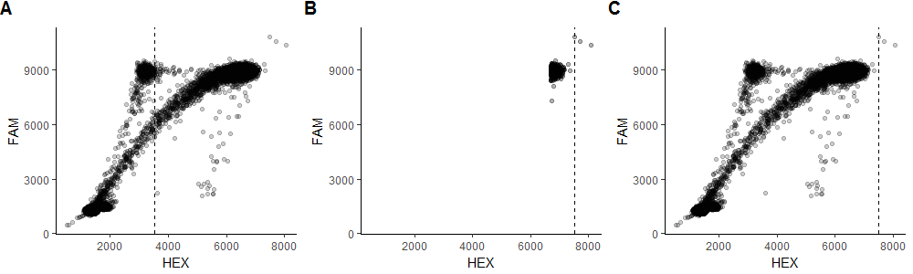
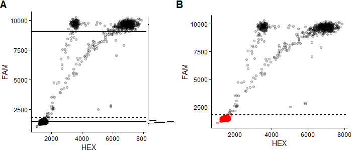

  
```{r setup, echo = FALSE, message = FALSE}
knitr::opts_chunk$set(tidy = FALSE, comment = "#>")
```

# Algorithms used to analyze ddPCR droplets

The algorithm described below consists of five main steps that are used to analyze a ddPCR plate with (FAM+)/(FAM+HEX+) clusters. Droplets in the (FAM+HEX+) cluster will be referred to as *wildtype*, and droplets in the (FAM+HEX-) cluster will be referred to as *mutant*. The final goal is to calculate the mutant frequency (*MF*) in each well by classifying all temlpate-containing droplets as wildtype or mutant.

Plates with (HEX+)/(FAM+HEX+) clusters use a very similar algorithm but HEX and FAM are swapped in every step. Plates that are neither (FAM+)/(FAM+HEX+) nor (HEX+)/(FAM+HEX+) only benefit from the first three steps of the pipeline (droplet gating is not performed). 

The initial droplet data is a list of *n* matrices, where *n* is the number of wells. Each matrix contains has two clumns and *m_i* rows, where *m_i* is the number of droplets in the *i*-th well. Each row represents a single droplet in a well and the two columns are the measured values of HEX and FAM fluorescence intensity. 

## Step 1: Identify failed wells

The first step is to identify any wells that clearly failed the ddPCR run by checking four quality control metrics.

The first check is to ensure the total number of droplets in a well must exceed a specific threshold value (`params(plate, 'REMOVE_FAILURES', 'TOTAL_DROPS_T')`, default is 5000). BioRad claims that wells should have 20,000 droplets, but in practice we usually see between 12,000-17,000 droplets per well, and any well with too few droplets is considered a failure.

The other three metrics evaluate the expected droplet clusters (empty, mutant, wildtype) and their quality by fitting a two-component Gaussian mixture model to the FAM signals of all droplets. Each of the two components is defined with a mean (*center*) and a standard deviation (*sd*). In a typical well, the distribution with the lower center will capture the empty droplets, while the higher distribution models the FAM+ (or template-containing) droplets. Every well is expected to have mostly empty droplets, so the second metric involves looking for acceptable segregation of empty droplets from the FAM+ cluster by measuring the difference between the centers of the two distributions. The third metric evaluates the droplet density within the lower (empty) population to ensure the fraction of empty droplets is above a certain threshold (`params(plate, 'REMOVE_FAILURES', 'EMPTY_LAMBDA_LOW_T')`, default is 0.3). Failure to meet this criterion indicates a lack of a defined empty cluster. Similarly, the fourth quality control check ensures the droplet density must also be below a certain fraction (`params(plate, 'REMOVE_FAILURES', 'EMPTY_LAMBDA_HIGH_T')`, default is 0.99), as having too many empty droplets is a sign that there is not enough amplifiable template in the well.

Any well that does not meet all four criteria is deemd a failed run, and such wells are removed from further analysis.

## Step 2: Identify outlier droplets

While the FAM and HEX signal intensities have a lower bound of 0, there is no upper bound on the value the ddPCR reader may read. As a result, it is possible to observe a small number of droplets with abnormally large HEX or FAM values, which can be considered outlier droplets.  A common method for detecting outliers in normal distributions is to calculate the first quartile (*Q1*), third quartile (*Q3*), and interquartile range (*IQR*, defined as *Q3 - Q1*), and define any observations that fall outside the range of [_Q1 - 1.5\*IQR_, _Q3 + 1.5\*IQR_] as outliers.

If ddPCR data was normally distributed and this method could be used, only the upper bound of _Q3 + 1.5\*IQR_ would be used to define outliers, as there are no outliers on the lower end of the distribution because most values are close to the minimum value of 0.  However, ddPCR data is extremely skewed and non-normal, so the common outlier detection approach will not work. Instead, a small tweak can be made to make it applicable to ddPCR data. For each signal dimension (FAM and HEX) we identify the top *p* percent (*p* = `params(plate, 'REMOVE_OUTLIERS', 'TOP_PERCENT')`, default is 1%) of droplets having the highest signal value in that dimension out of droplets in the entire plate. An outlier threshold is then defined as _Q3 + k\*IQR_ (*k* = `params(plate, 'REMOVE_OUTLIERS', 'CUTOFF_IQR')`, default is 5) of this subset of droplets, and any droplets that have a signal value larger than this threshold are considered outliers. This is essentially a variation of the common outlier detection method but the outlier threshold is calculated using only a fraction of the droplets.

Any droplet in any well that has a FAM value exceeding the FAM outlier threshold or a HEX value exceeding the HEX outlier threshold is considered an outlier droplet, and removed from further analysis. The figure below shows a summary of this method.

[](../inst/vignettes-supp/outliers.png)

Plot A shows a well with a clear outlier on the far right. The dotted line shows the HEX value that corresponds to _Q3 + 5\*IQR_ of all HEX values, which is clearly a poor threshold for determinig outliers. Plot B shows only the 1% of droplets with the highest HEX value, while the dotted line shows the value of _Q3 + 5\*IQR_ of the HEX values of only those droplets. Plot C shows the full well data and the outlier threshold calculated using the top 1% of the droplets. Using this threshold, the lone outlier point at the extreme HEX value (marked in red) is identified as an outlier.

## Step 3: Identify empty droplets

Droplets with very low fluorescent signal are considered empty and are removed from any downstream analysis. These droplets do not contain any amplifiable template and make up the majority of droplets in a typical well. The removal of empty droplets is beneficial for two reasons. First, it greatly reduces the dimension of the data, which consequently allows for faster computations on the remaining droplets. Secondly, removing the major cluster of empty droplets also serves to eliminate any bias in a statistic model that would be otherwise dominated by the large number of empty droplets. While a large portion of the droplets is discarded, no useful information is lost as all the template-containing droplets are retained.

Empty droplets are identified in each well separately. First, a two-component Gaussian mixture model is fitted to the FAM signals of all droplets in a well. Only the FAM signal is used because all empty droplets emit no FAM signal while all template-containing droplets will surely emit FAM signal. Note that the same argument cannot be applied to the HEX signal because both empty droplets and mutant droplets are HEX-, so FAM can be used as a discriminant for empty droplets while HEX cannot. The Gaussian distribution with the lower mean is assumed to be modelling the empty droplets, and it will likely have a fairly small standard deviation (*sd*) as the empty droplets are densely clustered. A FAM threshold for empty droplets is then calculated under the assumption that the FAM value of empty droplets can be roughly modeled by a normal distribution. Specifically, a threshold is defined as _mean + k\*sd_ (*k* = `params(plate, 'REMOVE_EMPTY', 'CUTOFF_SD')`, default is 7) of the lower (empty) distribution.

Any droplets in the well with a FAM value lower than the threshold are deemed empty and not considered in further analysis. The figure below shows a summary of this step.

[](../inst/vignettes-supp/empty.png)

Plot A shows a well and a marginal density plot of the FAM values of its droplets. The solid lines are the means of the two Gaussian distributions fitted to the FAM values, while the dotted line is the _mean + 7\*sd_ of the lower one. Plot B shows that using the _mean + 7\*sd_ value is a fairly accurate threshold for the empty droplets (marked in red).


## Step 4: Gate droplets

The main step of the pipeline is to gate the remaining droplets automatically and assign each droplet as either *mutant*, *wildtype*, or *rain*. Rain droplets are droplets that are not empty, yet the ddPCR reader did not detect enough fluorescence emitted from them, which could be caused by poor quality DNA. Droplets that do have enough high quality template are defined as *filled* droplets; every filled droplet is either mutant or wildtype.

The gating step is best explained by being broken down into several sub-steps.

### Step 4.1: Identify rain droplets

Similarly to the way empty droplets are identified in each well by calculating a FAM threshold, rain droplets are also identified using a unique FAM threshold in each well. A two-component Gaussian mixture model is fitted to the FAM signals of all droplets in each well. The filled droplets (mutant and wildtype) all have similar FAM values, while the rain droplets have a wider range of FAM values and have, by definition, lower FAM values. Therefore, the Gaussian distribution with the higher mean is assumed to capture the filled droplets. A FAM threshold is calculated as _mean - k\*sd_ (*k* = `params(plate, 'CLASSIFY', 'CLUSTERS_BORDERS_NUM_SD')`, default is 3) of the higher (filled) distribution. Any droplets in the well below this value are considered rain, and all droplets above the threshold are considered the filled droplets and are used in the next step.

### Step 4.2: Identify mutant versus wildtype droplets

All remaining droplets at this stage contain either mutant or wildtype templates. These droplets all have similar FAM values, while their HEX values are the best perdictor to discriminate between mutant and wildtype droplets. While employing simple clustering methods such as k-means to cluster the two groups of droplets may seem like a feasible solution, it does not yield good results on many datasets. Instead, the two clusters are defined by computing the density estimate of the distribution of HEX values, finding the local minimum of the density estimate, and defining this minimum as the gate between mutant and wildtype droplets. When computing the kernel density estimate, the degree of smoothing is an important variable that strongly affects the resulting clusters, so the algorithm attempts to find the optimal smoothing bandwidth by iteratively increasing the smoothing parameter and using heuristics to assess te quality of the density estimation.

With an ideal smoothing bandwidth, the density estimator of the HEX values will have two local maxima and one local minimum between them. The two local maxima capture the centers of the mutant and wildtype clusters, while the local minimum defines the border that separates wildtype from mutant droplets. To ensure the right-most peak corresponds to wildtype droplets and is not simply a result of a few outliers, heuristic checks are performed. The peak is ignored if it is believed to be centered on outliers instead of the wildtype cluster. If the smoothing bandwidth is too high, the mutant cluster will not be identified, while too low of a bandwidth will falsely identify most droplets as mutant. The optimal bandwidth for correct gating varies between wells within the same dataset, so an iterative process of finding the optimal smoothing parameter is performed in every well by multiplying the default bandwidth by an increasingly larger parameter *k*.

Initially, *k* is set to a specific value *k_min* (*k_min* = `params(plate, 'CLASSIFY', 'ADJUST_BW_MIN')`, default is 4) and the kernel density is estimated by adjusting the default smoothing bandwidth by *k*. If there is only one local maximum in the density curve, then all the droplets are assumed to be wildtype. If there are two local maxima, then a gate is drawn at the local minimum between the two maxima, with the droplets on the lower end assigned to the mutant cluster and the droplets on the higher end assigned as wildtype. If there are more than two local maxima, *k* is increased in small increments until a final value of *k_max* (*k_max* = `params(plate, 'CLASSIFY', 'ADJUST_BW_MAX')`, default is 20). At each iteration, the number of local maxima is inspected until there are only two, at which point the gate is defined as mentioned previously. If no values of *k* produce acceptable results, the gate is still defined using the two left-most local minimum, but the well is also flagged as inaccurate in order for the user to review it.

### Step 4.3: Classify wells as mutant versus wildtype

After determining which droplets are mutant and wildtype, the *mutant frequency* of each well is calculated as _mutant frequency = number of mutant droplets / (number of mutant droplets + number of wildtype droplets) \* 100%_. Using the mutant frequency of each well, it is possible to classify each well as a wildtype well (containing mostly wildtype droplets) or a mutant well (containing a statistically significant number of mutant droplets). In this algorithm, a mutant well is defined as having a mutant frequency that is statistically significantly higher than *p*% (*p* = `params(plate, 'CLASSIFY', 'SIGNIFICANT_NEGATIVE_FREQ')`, default is 1%) at a significance level of *s* (*s* = `params(plate, 'CLASSIFY', 'SIGNIFICANT_P_VALUE')`, default is 0.01). The binomial test is carried out for this task, with the null hypothesis being that the real mutant frequency is at most *p*%.  As an example, a well with 500 filled droplets that includes 7 mutant droplets is classified as a wildtype well as the p-value is higher than 0.01 (*P(X >= 7) = 1 - P(X < 7) = 1 - [P(X = 0) + P(X = 1) + ... + P(X = 6)] = 1 - [b(0; 500, 0.01) + b(1; 500, 0.01) + ... + b(6; 500, 0.01)] = 0.237 > 0.01*) despite a mutant frequency of 1.4% (_7 / 500 \* 100_), while a well with 5000 filled droplets that includes 70 mutant droplets has an identical mutant frequency but is deemed as mutant because of a significant p-values (*P(X >= 70) = 1 - P(X < 70) = 1 - [P(X = 0) + P(X = 1) + ... + P(X = 69)] = 1 - [b(0; 5000, 0.01) + b(1; 5000, 0.01) + ... + b(69; 5000, 0.01)] = 0.004 < 0.01*).

## Step 5: Revisit gating of wildtype wells

Mutant wells have clearly defined clusters of mutant and wildtype droplets, making it easy to determine where to gate them. On the other hand, wildtype wells have very few (if any) mutant droplets, making it difficult to accurately identify them. It is possible to leverage the data in mutant wells to get a more accurately find mutant droplets in wildtype wells. This is only possible if there are enough wells to draw data from, so this step only runs if there are at least *n* mutant wells in the plate (*n* = `(plate, 'RECLASSIFY', 'MIN_WELLS_NEGATIVE_CLUSTER')`, default is 4).

The idea is to see where the mutant cluster is located relative to the wildtype cluster in most wells, and assume that wildtype wells are distributed similarly. To measure this feature, a special *mutant-to-wildtype ratio* is calculated for every mutant well by comparing the HEX value of the right-most mutant droplet to the median HEX value of the wildtype droplets (*mutant-to-wildtype ratio = max(mutant) / median(wildtype)*). After calculating this ratio for all mutant wells and obtaining a list of such ratios, a single value is used as the "consensus" ratio by choosing a certain percentile from the list (`params(plate, 'RECLASSIFY', 'BORDER_RATIO_QUANTILE'))`, default is 75).  The median HEX value of filled droplets in each wildtype well is multiplied by the consensus mutant-to-wildtype ratio, and the resulting value is used as the new border between mutant and wildtype droplets.