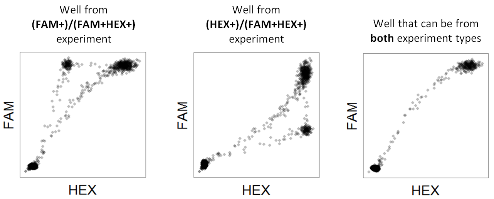

  
```{r setup, echo = FALSE, message = FALSE}
knitr::opts_chunk$set(tidy = FALSE, comment = "#>")
```

# ddpcr: Analysis and visualization of Digital Droplet PCR data in R and on the web

This package provides an interface to explore, analyze, and visualize droplet digital PCR (ddPCR) data in R. An interactive tool was also created and is available online to facilitate this analysis for anyone who is not comfortable with using R.

# Background

Droplet Digital PCR (ddPCR) is a technology provided by Bio-Rad for performing digital PCR. The basic workflow of ddPCR involves three main steps: partitioning sample DNA into 20,000 droplets, PCR amplifying the nucleic acid in each droplet, and finally passing the droplets through a reader that detects flurescent intensities in two different wavelengths corresponding to FAM and HEX dyes. As a result, the data obtained from a ddPCR experiment can be visualized as a 2D scatterplot (one dimension is FAM intensity and the other dimension is HEX intensity) with 20,000 points (each droplet represents a point).

ddPCR experiments can be defined as singleplex, duplex, or multiplex depending on the number of dyes used (one, two, and more than two, respectively). A duplex experiment typically uses one FAM dye and one HEX dye, and consequently the droplets will be grouped into one of four clusters: double-negative (not emitting fluorescence from either dye), HEX-positive, FAM-positive, or double-positive. When plotting the droplets, each quadrant of the plot corresponds to a cluster; for example, the droplets in the lower-left quadrant are the double-negative droplets.

After running a ddPCR experiment, a key step in the analysis is gating the droplets to determine how many droplets belong to each cluster. Bio-Rad provides an analysis software called QuantaSoft which can be used to perform gating. QuantaSoft can either do the gating automatically or allow the user to set the gates manually. Most ddPCR users currently gate their data manually because QuantaSoft's automatic gating often does a poor job and **there are no other tools available for gating ddPCR data**.

# Overview

The `ddpcr` package allows you to upload ddPCR data, perform some basic analysis, explore characteristic of the data, and create customizable figures of the data.  

## Main features

The main features include:

- **Identify failed wells** - determining which wells in the plate seemed to have failed the ddPCR experiment, and thus these wells will be excluded from all downstream analysis. No template control (NTC) will be deemed as failures by this tool.
- **Identify outlier droplets** - sometimes a few droplets can have an extremely high fluorescent intensity value that is probably erroneous, perhaps as a result of an error with the fluorescent reader. These droplets are identified and removed from the downstream analysis.
- **Identify empty droplets** - droplets with very low fluorescent emissions are considered empty and are removed from the downstream analysis. Removing these droplets is beneficial for two reasons: 1. the size of the data is greatly reduced, which means the computations will be faster on the remaining droplets, and 2. the real signal of interest is in the non-empty droplets, and empty droplets can be regarded as noise.
- **Calculating template concentration** - after knowing how many empty droplets are in each well, the template concentration in each well can be calculated.
- **Gating droplets** - if your experiment matches some criteria (more on that soon), then automatic gating can take place; otherwise, you can gate the data with custom thresholds just like on QuantaSoft.
- **Explore results** - the results from each well (# of drops, # of outliers, # of empty drops, concentration, etc.) can be explored as a histogram or boxplot to see the distribution of all wells in the plate.
- **Plot** - you can plot the data in the plate with many customizable parameters

## Supported experiment types

While this tool was originally developed to automatically gate data for a particular ddPCR assay (TODO reference to Roza's paper), any assay with similar characteristics can also use this tool to automatically gate the droplets. In order to benefit from the full automatic analysis, your ddPCR experiment needs to have these characteristics:  

- The experiment is a duplex ddPCR experiment
- The majority of droplets are empty (double-negative)
- The majority of non-empty droplets are double-positive
- There can be a third cluster of either FAM+ or HEX+ droplets

In other words, the built-in automatic gating will work when there are three clusters of droplets: (1) double-negative, (2) double-positive, and (3) either FAM+ or HEX+. These types of experiments will be referred to as **(FAM+)/(FAM+HEX+)** or  **(HEX+)/(FAM+HEX+)**. Both of these experiment types fall under the name of **PNPP experiments**; PNPP is short for PositiveNegative/PositivePositive, which is a reflection of the droplet clusters. Here is what a typical well from a PNPP experiment looks like:

[](../inst/img/supported-exp-types.png)

If your experiment matches the criteria for a **PNPP** experiment (either a **(FAM+)/(FAM+HEX+)** or a **(HEX+)/(FAM+HEX+)** experiment), then after calculating empty droplets the program will analyze the rest of the droplets and assign each droplet one of the following three clustes: FAM+ (or HEX+), FAM+HEX+, or rain. Here is the result of analyzing a single well from a **(FAM+)/(FAM+HEX+)** experiment:

[](../inst/img/pnpp-simple-result.png)

If your ddPCR experiment is not a **PNPP** type, you can still use this tool for the rest of the analysis, exploration, and plotting, but it will not benefit from the automatic gating. However, `ddpcr` is built to be easily extensible, which means that you can add your own experiment type. Custom experiment types need to define their own method for gating the droplets in a well, and then they can be used in the same way as the built-in experiment types.

# Analysis using the interactive tool

If you're not comfortable using R and would like to use a visual tool that requires no programming, you can [use the tool online](TODO). If you do know how to run R, using the interactive tool (built with [shiny](http://shiny.rstudio.com/)) is still a good option as it can be easier to analyze than using the command line. If you do use the online tool, you should still skim through the rest of this document (you can ignore the actual code/commands) as it will explain some important concepts.

# Analysis using R

Enough talking, time for action!

First, install `ddpcr`

```
devtools::install_github("daattali/ddpcr")
```

Note: throughout this document, *FAM*  will be synonymous to *Y axis* and *HEX* will be synonymous to *X axis*, as a reflection of the fact that conventionally when visualizing the data the FAM intensity is plotted on the Y axis and the HEX intensity is on the X axis.

## Running the interactive tool through R

Even if you do know R, using the interactive application can be easier and more convenient than running R commands. If you want to use the tool, simply run `ddpcr::shine()` and it will run the same application that's hosted online on your own machine.

## Quick start

Here are two basic examples of how to use `ddpcr` to analyze and plot your ddPCR data. One example shows an analysis where the gating thresholds are manually set, and the other example uses the automated analysis. Note how `ddpcr` is designed to play nicely with the [magrittr pipe](https://github.com/smbache/magrittr) `%>%` for easier pipeline workflows. Explanation will follow, these are just here as a spoiler.

```{r quickstart, message = FALSE, fig.show='hold', out.width='50%', fig.retina=FALSE}
library(ddpcr)
dir <- system.file("sample_data", "small", package = "ddpcr")

# example 1: manually set thresholds
plate1 <-
  new_plate(dir, type = plate_types$custom_thresholds) %>%
  subset("B01,B06") %>%
  set_thresholds(c(5000, 7500)) %>%
  analyze
plot(plate1, show_grid_labels = TRUE, alpha_drops = 0.3,
       title = "Manually set gating thresholds\nworks with any data")

# example 2: automatic gating
new_plate(dir, type = plate_types$fam_positive_pnpp) %>%
  subset("B01:B06") %>%
  analyze %>%
  plot(show_mutant_freq = FALSE, show_grid_labels = TRUE, alpha_drops = 0.3,
       title = "Automatic gating\nworks with PNPP experiments")
```

## Running a basic analysis - detailed walkthrough

This section will go into details of how to use `ddpcr` to analyze ddPCR data.

### Loading ddPCR data

The first step is to get the ddPCR data into R. `ddpcr` uses the data files that are exported by QuantaSoft as its input. You need to have all the well files for the wells you want to analyze (one file per well), and you can optionally add the results file from QuantaSoft. If you loaded an experiment named *2015-05-20_mouse* with 50 wells to QuantaSoft, then QuantaSoft will export the following files:

- 50 data files (well files): each well will have its own file with the name ending in *_Amplitude.csv". For example, the droplets in well A01 will be saved in *2015-05-20_mouse_A01_Aamplitude.csv*
- 1 results file: a small file named *2015-05-20_mouse.csv* will be generated with some information about the plate, including the name of the sample in each well (assuming you named the samples previously)

The well files are the only required input to `ddpcr`, and since ddPCR plates contain 96 wells, you can upload anywhere from 1 to 96 well files. The results file is not mandatory, but if you don't provide it then the wells will not have sample names attached to them.

`ddpcr` contains a sample dataset called *small* that has 5 wells. We use the `new_plate()` function to initialize a new ddPCR plate object. If given a directory, it will automatically find all the valid well files in the directory and attempt to find a matching results file.

```{r readdata}
library(ddpcr)
dir <- system.file("sample_data", "small", package = "ddpcr")
plate <- new_plate(dir)
```

You will see some messages appear - every time `ddpcr` runs an analysis step (initializing the plate is part of the analysis), it will output a message decribing what it's doing.

### Pre-analysis exploration of the data

We can explore the data we loaded even before doing any analysis

```{r printprint}
plate
```

Among other things, this tells us how many wells and total droplets we have in the data, and what steps of the analysis are remaining. All the information that gets shown when you print a ddpcr plate object is also available through other functions that are dedicated to show one piece of information. For example

```{r explore-1}
plate %>% name  # equivalent to `name(plate)`
plate %>% type  # equivalent to `type(plate)`
```

Since we didn't specify an experiment type, this plate object has the default type of `ddpcr_plate`.

We can see what wells are in our data with `wells_used()`   

```{r explore-2}
plate %>% wells_used
```

There are 5 wells because the sample data folder has 5 well files.

We can see all the droplets data with `plate_data()` 

```{r explore-3}
plate %>% plate_data
```

This shows us the fluorescent intensities of each droplet, along with the current cluster assignment of each droplet. Right now all droplets are assigned to cluster 1 which corresponds to *undefined* since no analysis has taken place yet.  You can see all the clusters that a droplet can belong to with the `clusters()` function

```{r explore-4}
plate %>% clusters
```

This tells us that any droplet in a `ddpcr_plate`-type experiment can be classified into those clusters.  Any droplet is initially *UNDEFINED*, droplets in failed wells are marked as *FAILED*, and the other two names are self explanatory.

We can see the results of the plate so far with `plate_meta()`

```{r explore-5}
plate %>% plate_meta(only_used = TRUE)
```

The `only_used` parameter is used so that we'll only get data about the 5 existing wells and ignore the other 91 unused wells on the plate. Notice that *meta* (short for *metadata*) is used instead of *results*. This is because the meta/results table contains information for each well such as its name, number of drops, number of empty drops, concentration, and many other calculated values. 

### Subset the plate

If you aren't interested in all the wells, you can use the `subset()` function to retain only certain wells. Alternatively, you can use the `data_files` argument of the `new_plate()` function to only load certain well files instead of a full directory.  
The `subset()` function can take accept either a list of sample names, a list of wells, or a special *range notation*. The range notation is a convenient way to select many wells: use a colon (`:`) to specify a range of wells and a comma (`,`) to add another well or range. A range of wells is defined as all wells in the rectangular area between the two endpoints. For example, `B05:C06` corresponds to the four wells `B05, B06, C05, C06`.  The following diagram shows the result of subsetting with a range notation of `A01:H03, C05, E06, B07:C08` on a plate that initially contains all 96 wells.  

[](../inst/img/ex-subset.png)

Back to our data: we have 5 wells, let's keep 4 of them

```{r subset}
plate <- plate %>% subset("B01:C06")
# could have also used subset("B01, B06, C01, C06")
plate %>% wells_used
```

### Run analysis

An analysis of a ddPCR plate consists of running the plate through a sequence of steps. If you care to know, you can see what all the steps for a particular experiment are

```{r steps}
plate %>% steps %>% names
```

These steps are the default steps that any ddpcr plate will go through by default if no type is specified. At this point all we did was load the data, so the initialization step was done and there are 3 remaining steps. You can either run through the steps one by one using `next_steps()` or run all remaining steps with `analyze()`.

```{r analyze}
plate <- plate %>% analyze
# equivalent to `plate %>% next_step(3)`
# also equivalent to `plate %>% next_step %>% next_step %>% next_step`
```

As each step of the analysis is performed, a message describing the current step is printed to the screen. Since we only have 2 wells, it should be very fast, but when you have a full 96-well plate, the analysis could take several minutes. Sometimes it can be useful to run each step individually rather than all of them together if you want to inspect the data after each step.

### Post-analysis exploration of the data

We can explore the plate again, now that it has been analyzed.

```{r explore-post-1}
plate
```

We now get a message that says the analysis is complete (earlier it said what steps are remaining). We can also look at the droplets data

```{r explore-post-2}
plate %>% plate_data
```

This isn't very informative since it shows the cluster assignment for each droplet, which is not easy for a human to digest. Instead, this information can be visualized by plotting the plate (coming up). We can also look at the plate results 

```{r explore-post-3}
plate %>% plate_meta(only_used = TRUE)
```

Now there's a bit more information in the results table. The *success* column indicates whether or not the ddPCR run was successful in that particular well; notice how well `C06` was deemed a failure, and thus is not included the any subsequent analysis steps.

You can use the `well_info()` function to get the value of a specific variable of a specific well from the results.

```{r explore-post-4}
well_info(plate, "B06", "drops_empty")
```

### Plot

The easiest way to visualize a ddPCR plate is using the `plot()` function. 

```{r plotsimple}
plate %>% plot
```

Notice well `C06` is grayed out, which means that it is a failed well. By default, failed wells have a grey background, and empty and outlier droplets are excluded from the plot. 

You don't have to analyze a plate object before you can plot it - a ddPCR plate can be plotted at any time to show the data in it. If you plot a plate before analysing it, it'll show the raw data.

### Plot parameters

There are many plot parameters to allow you to create extremely customizable plots. Among the many parameters, there are three special categories of parameters that affect the visibility of droplets: `show_drops_*` is used to show/hide certain droplets, `col_drops_*` is used to set the colour of droplets, and `alpha_drops_*` is used to set the transparency of droplets (0 = transparent, 1 = opaque). The `*` can be replaced by the name of any droplet cluster (the available clusters can be obtained with `clusters(plate)` as mentioned earlier). For example, to show the outlier droplets in blue you would need to add the parameters `show_drops_outlier = TRUE, col_drops_outlier = "blue"`.

The following two plots show examples of how to use some plot parameters.

```{r plotparams, fig.show='hold', out.width='50%', fig.retina=FALSE}
plate %>% plot(wells = "B01,B06", show_full_plate = TRUE,
               show_drops_empty = TRUE, col_drops_empty = "red",
               title = "Show full plate")
plate %>% plot(wells = "B01,B06", superimpose = TRUE,
               show_grid = TRUE, show_grid_labels = TRUE, title = "Superimpose")
```

### Save your data

As was shown previously, you can use the `plate_meta()` function to retrieve a table with the results. If you want to save that table, you can use R's builtin `write.csv()` or `write.table()` functions.

You can also save a ddPCR plate object using `plate_save()`. This will create a single `.rds` file that contains an exact copy of the plate's current state, including all the data, attributes, and analysis progress of the plate. The resulting file can be loaded to restore the ddPCR object at a later time with `plate_load()`.

```{r saveload}
plate %>% save_plate("myplate")
from_file <- load_plate("myplate")
identical(plate, from_file)
rm(from_file)
unlink("myplate.rds")
```

### Plate parameters

Every ddPCR plate object has adjustable parameters associated with it. There are general parameters that apply to the plate as a whole, and each analysis step has its own set of parameters that are used for the algorithm in that step. You can see all the parameters of a plate using the `params()` function

```{r paramsstr}
plate %>% params %>% str
```

You can also view the parameters for a specific step or the value of a parameter. For example, to see the parameters used in the step that identifies failed wells, use

```{r paramsfailures}
plate %>% params("REMOVE_FAILURES")
```

You can also view or edit specific parameters. When identifying failed wells, one of the conditions for a successful run is to have at least 5000 droplets in the well (Bio-Rad claims that every well has 20000 droplets). If you know that your particular experiment had much less droplets than usual and as a result `ddpcr` thinks that all the wells are failures, you can change the setting

```{r setparams}
params(plate, "REMOVE_FAILURES", "TOTAL_DROPS_T")
params(plate, "REMOVE_FAILURES", "TOTAL_DROPS_T") <- 1000
params(plate, "REMOVE_FAILURES", "TOTAL_DROPS_T")
```

If you look at the full parameters of the plate, you'll notice that by default `ddpcr` assumes that the dyes used are *FAM* and *HEX*. If you are using a different dye and want the name of that dye appear in the results instead, you can use the `x_var()` or `y_var()` functions.

```{r changexvar}
orig_x <- x_var(plate)
orig_x
x_var(plate) <- "VIC"
plate %>% plate_data %>% names
x_var(plate) <- orig_x
```

Note that if you change any parameters, you need to re-run the analysis. If you try running `analyze()` after a plate has already been analyzed, you will simply get a message saying the plate is already analyzed. To force an already-analyzed plate to re-run the analysis, you need to use the `restart = TRUE` parameter.

```{r reanalyze}
plate <- analyze(plate)
plate <- analyze(plate, restart = TRUE)
```

## Analysing any ddPCR plate with manual droplet gating

The previous walkthrough shows the results of a basic analysis when using the default plate type. If you want to also perform a simple 4-quadrant gating like the one available in QuantaSoft, you need to set the type of the plate object to `plate_types$custom_thresholds`. This can either be done when initializing a new plate or by reseting an existing plate object.

```{r reset, message=FALSE}
plate_manual <- reset(plate, type = plate_types$custom_thresholds)
plate_manual2 <- new_plate(dir, type = plate_types$custom_thresholds) %>% subset("B01:C06")
identical(plate_manual, plate_manual2)
plate_manual
rm(plate_manual2)
```

It's usually a good idea to take a look at the raw data to decide where the draw the thresholds

```{r plotcrosshair}
plot(plate_manual, show_grid_labels = TRUE)
```

If you noticed, there's a droplet in well *C06* that has a HEX value of 25000 and is probably an outlier, which is the cause of the weird scale.  After analyzing the plate, it will be identified as an outlier and hidden automatically. Before running the analysis, we should set where the thresholds will be. By default, the thresholds are at (5000, 5000), which is very arbitrary. It looks like the x coordinate is fine, but the y border should move up to approximately 8000. Then run the analysis.

```{r setthresholds}
thresholds(plate_manual)
thresholds(plate_manual) <- c(5000, 8000)
plate_manual <- analyze(plate_manual)
```

NoW the plate is ready and we can plot it or look at its results

```{r crosshairresults}
plate_meta(plate_manual, only_used = TRUE)
plot(plate_manual)
```

By default, the droplets in each quadrant are a different colour. If you want to change the colour of some droplets, we can use the `col_drops_*` parameter as before. Since now we're working with a different plate type, the names of the droplet clusters can be different, so we need to first know what they are

```{r crosshairclusters}
clusters(plate_manual)
```

Now if we want to change the colour of the double-positive droplets to red, we just add a parameter `col_drops_both_positive = "red"`.

## Analysing PNPP experiments with automated gating 

If you have a *PNPP* experiment (*(FAM+)/(FAM+HEX+)* or *(HEX+)/(FAM+HEX+)*) then `ddpcr` can do a full automatic analysis on the plate. The sample dataset is from a *(FAM+)/(FAM+HEX+)* experiment, so we can take advantage of the automatic gating.

The first step is to define the type of plate. Again, this can be done wither by resetting an existing plate and specifying a different type, or by specifying a type when initializing a plate.

```{r pnppdefine}
plate_pnpp <- new_plate(dir, type = plate_types$pnpp_experiment)
```

This time the plate is not being subset, so we will retain all 5 wells in the raw data.

### Defining *(FAM+)/(FAM+HEX+)* vs *(HEX+)/(FAM+HEX+)* 

Before being able to analyze the plate, we need to set one important parameter: the *positive dimension*. This parameter tells `ddpcr` whether this is a c or a *(HEX+)/(FAM+HEX+)* experiment. The possible values are "X" and "Y", which correspond to HEX+ and FAM+, respectively.

```{r pnppsetdim}
positive_dim(plate_pnpp) <- "Y"
```

### Clusters of a PNPP experiment

Before running the analysis, you should know what are the possible cluster groupings that a droplet can belong to

```{r pnppclusters}
clusters(plate_pnpp)
```

The first 4 are common to all plate types and were seen in the previous examples. Droplets in the *HEX+FAM+* cluster are considered *POSITIVE*, while dropets in the *FAM+* cluster are considered *NEGATIVE* since they are *HEX-*. If this were a *(HEX+)/(FAM+HEX+)* instead and we had defined the *positive_dim* to be *HEX*, then the *NEGATIVE* cluster would refer to *HEX+*. Any droplets that are not empty but don't emit enough fluorescent intensity to be in the *POSITIVE* or *NEGATIVE* clusters are considered *RAIN*. 

### Analysis of a PNPP experiment

Now we can analyze the plate

```{r pnppanalyze}
plate_pnpp <- analyze(plate_pnpp)
```

One of the key goals in running the analysis is to determine the number of *POSITIVE* and *NEGATIVE* droplets in each well, and similarly the *negative frequency*. If a well has 95 *POSITIVE* droplets and 5 *NEGATIVE* droplets, then the *negative frequency* in the well is 5%.  
You can see from the output that the two last steps are **classifying** and **reclassifying** the droplets, and that the reclassification didn't take place. The classification step identifies all the non-empty droplets as either *RAIN*, *POSITIVE*, or *NEGATIVE* by analyzing each well individually. Wells with a very small *negative frequency* (there are few droplets in the *NEGATIVE* cluster) are much harder to gate accurately, which is the reason for the reclassification step. The reclassification step uses information from wells with high a *negative frequency* to make, where the gates are more clearly defined, to adjust the gates in wells with a low *negative frequency*. The reclassification step only takes place if there are enough wells with a high negative frequency.

### Results of a PNPP experiment

Take a look at the results

```{r pnppmeta}
plate_pnpp %>% plate_meta(only_used = TRUE)
```

Explanation of some of the variables:

- **negative_num** and **positive_num** - the number of droplets in the *negative* and *positive* clusters
- **negative_freq** - the frequency (0-1) of non-empty, non-rain droplets that are *negative*
- **significant_negative_cluster** - TRUE if the a contains a statistically significant number of *negative* droplets, FALSE if most droplets are *positive*

Plotting the data is usually the best way to see the results

```{r pnppplot}
plate_pnpp %>% plot(text_size_negative_freq = 8)
```

The *positive* droplets are green and the *negative* droplets are purple. The well colours themselves reflect the **significant_negative_cluster** variable: wells that are mostly *positive* droplets are green, and wells with significant negative clusters are purple. There are parameters to set all these colours, the transparency levels, and many more options.

Similarly to how `wells_failed()` returns the failed wells, you can use the `wells_negative()` and `wells_positive()` functions to extract the wells with a significant negative cluster and those without.

```{r pnppnegpos}
plate_pnpp %>% wells_negative
plate_pnpp %>% wells_positive
```

#### Reclassification of wells with low negative frequency

By default, the reclassification step takes place if there are at least 4 wells with a high enough negative frequency. If you look at the results or the plot of this dataset, you'll see that there are two such wells. You can change that number just like any other parameter, so we can lower it to 2

```{r pnppreclassify}
params(plate_pnpp, 'RECLASSIFY', 'MIN_WELLS_NEGATIVE_CLUSTER') <- 2
```

As a reminder, `params(plate_pnpp) %>% str` will list all the available parameters.

Now if we re-analyze the plate, the two wells with mostly *positive* droplets will be reanalyzed using the gate information from the other wells, which should not change much but it could be a little more accurate.

```{r pnppreclassifyplot}
plate_pnpp %>% analyze(restart = TRUE) %>% plot(text_size_negative_freq = 8)
```

## Algorithms used in each step

If you want to know how a step is performed, you can see the exact algorithm used in each step by consulting the `steps()` function.

```{r exactsteps}
plate_pnpp %>% steps
```

This list contains all the steps of analyzing the given plate, with each item in the list containing both the name of the step and the R function that performs it.  For example, the first step is *INITIALIZE* and it uses the function `init_plate()`.  You can see the code for that function by running `ddpcr:::init_plate`.

```{r stepsource}
ddpcr:::init_plate
```

